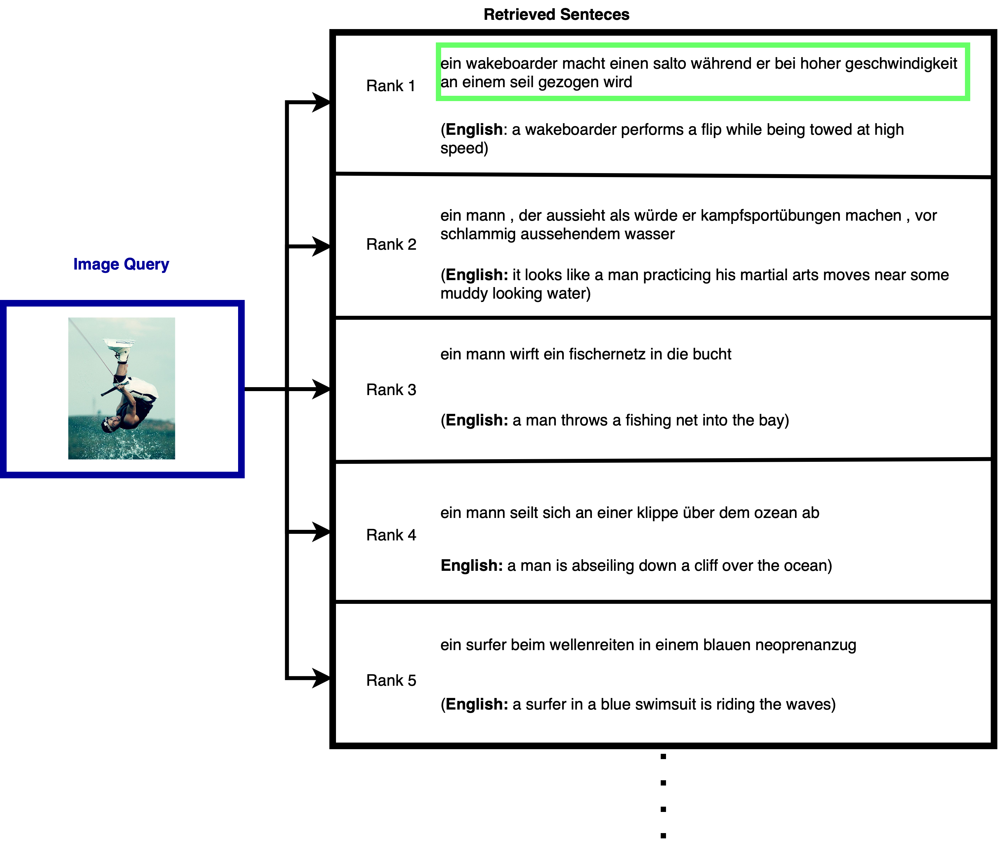

# MM-BERT

By 
[Faidon Mitzalis](https://github.com/phaedonmit/)

This repository is the implementation for the MSc thesis "Learning multilingual, multimodal embeddings for language and vision tasks". This repository has been forked from the VL-BERT official repository (https://github.com/jackroos/VL-BERT) presented in the paper 
[VL-BERT: Pre-training of Generic Visual-Linguistic Representations](https://arxiv.org/abs/1908.08530).


## Introduction

MM-BERT is a extends the VL-BERT model by making it multilingual. The MM-BERT model produces multilingual, multimodal embeddings
that can be used for various visual-linguistic tasks. 
The MM-BERT model takes advantage of large-scale training of VL-BERT but is also further trained on the [Multi30k dataset](https://github.com/multi30k/dataset)
to learn representations for multiple languages. The pre-trained MM-BERT model can be fine-tuned for various downstream visual-linguistic tasks, 
such as Image-Caption retrieval, Translation Retrieval, Multimodal Lexical Translation and Machine Translation.


**Figure 1:** Overview of the MM-BERT pre-training configuration for Task A



**Figure 2:** Example of using MM-BERT for caption retrieval in German on the 2016 Multi30k Test dataset

Special thanks to VL-BERT, PyTorch and its 3rd-party libraries and BERT. This codebase also uses the following features inherited from VL-BERT:
* Distributed Training
* FP16 Mixed-Precision Training
* Various Optimizers and Learning Rate Schedulers
* Gradient Accumulation
* Monitoring the Training Using TensorboardX

## Prepare

### Environment
* Ubuntu 16.04, CUDA 9.0, GCC 4.9.4
* Python 3.6.x
    ```bash
    # We recommend you to use Anaconda/Miniconda to create a conda environment
    conda create -n vl-bert python=3.6 pip
    conda activate vl-bert
    ```
* PyTorch 1.0.0 or 1.1.0
    ```bash
    conda install pytorch=1.1.0 cudatoolkit=9.0 -c pytorch
    ```
* Apex (optional, for speed-up and fp16 training)
    ```bash
    git clone https://github.com/jackroos/apex
    cd ./apex
    pip install -v --no-cache-dir --global-option="--cpp_ext" --global-option="--cuda_ext" ./  
    ```
* Other requirements:
    ```bash
    pip install Cython
    pip install -r requirements.txt
    ```
* Compile
    ```bash
    ./scripts/init.sh
    ```

### Data

See [PREPARE_DATA.md](data/PREPARE_DATA.md).

### Pre-trained Models

See [PREPARE_PRETRAINED_MODELS.md](model/pretrained_model/PREPARE_PRETRAINED_MODELS.md).


## Training

### Distributed Training on Single-Machine

```
./scripts/dist_run_single.sh <num_gpus> <task>/train_end2end.py <path_to_cfg> <dir_to_store_checkpoint>
```
* ```<num_gpus>```: number of gpus to use.
* ```<task>```: pretrain/MT/MLT/retrieval.
* ```<path_to_cfg>```: config yaml file under ```./cfgs/<task>```.
* ```<dir_to_store_checkpoint>```: root directory to store checkpoints.


Following is a more concrete example:
```
./scripts/dist_run_single.sh 4 vcr/train_end2end.py ./cfgs/vcr/base_q2a_4x16G_fp32.yaml ./
```

### Distributed Training on Multi-Machine

For example, on 2 machines (A and B), each with 4 GPUs, 

run following command on machine A:
```
./scripts/dist_run_multi.sh 2 0 <ip_addr_of_A> 4 <task>/train_end2end.py <path_to_cfg> <dir_to_store_checkpoint>
```

run following command on machine B:
```
./scripts/dist_run_multi.sh 2 1 <ip_addr_of_A> 4 <task>/train_end2end.py <path_to_cfg> <dir_to_store_checkpoint>
```


### Non-Distributed Training
```
./scripts/nondist_run.sh <task>/train_end2end.py <path_to_cfg> <dir_to_store_checkpoint>
```

***Note***:

1. In yaml files under ```./cfgs```, we set batch size for GPUs with at least 16G memory, you may need to adapt the batch size and 
gradient accumulation steps according to your actual case, e.g., if you decrease the batch size, you should also 
increase the gradient accumulation steps accordingly to keep 'actual' batch size for SGD unchanged.

2. For efficiency, we recommend you to use distributed training even on single-machine. But for RefCOCO+, you may meet deadlock
using distributed training due to unknown reason (it may be related to [PyTorch dataloader deadloack](https://github.com/pytorch/pytorch/issues/1355)), you can simply use
non-distributed training to solve this problem.

## Evaluation

### VCR
* Local evaluation on val set:
  ```
  python vcr/val.py \
    --a-cfg <cfg_of_q2a> --r-cfg <cfg_of_qa2r> \
    --a-ckpt <checkpoint_of_q2a> --r-ckpt <checkpoint_of_qa2r> \
    --gpus <indexes_of_gpus_to_use> \
    --result-path <dir_to_save_result> --result-name <result_file_name>
  ```
  ***Note***: ```<indexes_of_gpus_to_use>``` is gpu indexes, e.g., ```0 1 2 3```.

* Generate prediction results on test set for [leaderboard submission](https://visualcommonsense.com/leaderboard/):
  ```
  python vcr/test.py \
    --a-cfg <cfg_of_q2a> --r-cfg <cfg_of_qa2r> \
    --a-ckpt <checkpoint_of_q2a> --r-ckpt <checkpoint_of_qa2r> \
    --gpus <indexes_of_gpus_to_use> \
    --result-path <dir_to_save_result> --result-name <result_file_name>
  ```

### VQA
* Generate prediction results on test set for [EvalAI submission](https://evalai.cloudcv.org/web/challenges/challenge-page/163/overview):
  ```
  python vqa/test.py \
    --cfg <cfg_file> \
    --ckpt <checkpoint> \
    --gpus <indexes_of_gpus_to_use> \
    --result-path <dir_to_save_result> --result-name <result_file_name>
  ```

### RefCOCO+

* Local evaluation on val/testA/testB set:
  ```
  python refcoco/test.py \
    --split <val|testA|testB> \
    --cfg <cfg_file> \
    --ckpt <checkpoint> \
    --gpus <indexes_of_gpus_to_use> \
    --result-path <dir_to_save_result> --result-name <result_file_name>
  ```

## Visualization
See [VISUALIZATION.md](./viz/VISUALIZATION.md).

## Acknowledgements

Many thanks to following codes that help us a lot in building this codebase:
* [transformers (pytorch-pretrained-bert)](https://github.com/huggingface/transformers) 
* [Deformable-ConvNets](https://github.com/msracver/Deformable-ConvNets/)
* [maskrcnn-benchmark](https://github.com/facebookresearch/maskrcnn-benchmark)
* [mmdetection](https://github.com/open-mmlab/mmdetection)
* [r2c](https://github.com/rowanz/r2c)
* [allennlp](https://github.com/allenai/allennlp)
* [bottom-up-attention](https://github.com/peteanderson80/bottom-up-attention)
* [pythia](https://github.com/facebookresearch/pythia)
* [MAttNet](https://github.com/lichengunc/MAttNet)
* [bertviz](https://github.com/jessevig/bertviz)
